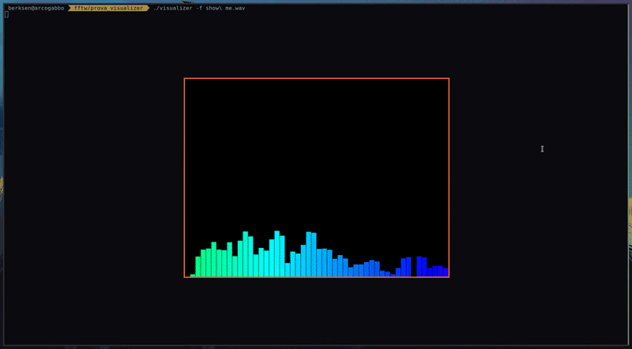
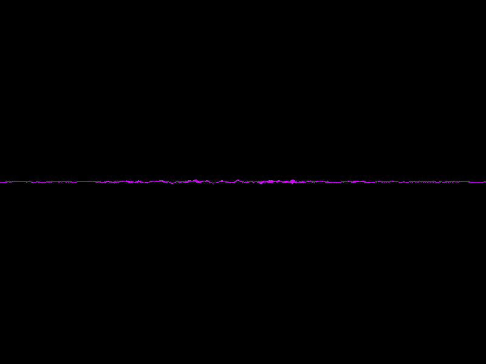

## C and SDL music visualizer

<p align="center">
    
</p>

`NEW:Change to time domain mode with m key`
<p align="center">
    
</p>


This simple real-time visualizer calculates the dft of a given stream and outputs the magnitudes

Sample usage with given options size and file (if you avoid the size it will be 2048 by default):

`./visualizer -s 2048 -f 'some file.wav'`

**NOTE: The audio format must be .wav (MP3 support still have to be implemented)**

Dependencies:
- SDL2
- FFTW3

You can easily find those in Arch extra packages:
```
sudo pacman -S sdl2
sudo pacman -S fftw
```
Or just install them yourself.

**__Have fun!__**

>It's not compatible with windows because the pthread API is different.
